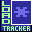
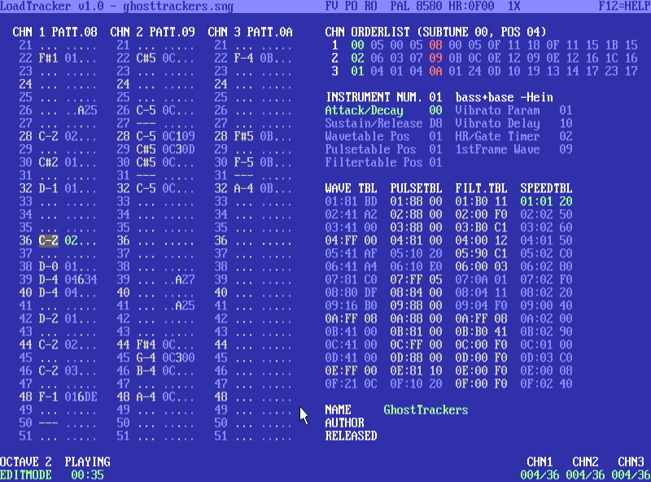

 LoadTracker
===========

A fork of [goattracker2](https://sourceforge.net/projects/goattracker2/) with the following features:

* ported to CMake build system
* ported to SDL3
* dots display extended to tables and enabled by default (inspired by [SpiderJ's fork](https://github.com/jansalleine/gt2fork))
* default to a C64 color theme, with an option to run with original colorscheme (inspired by [SpiderJ's fork](https://github.com/jansalleine/gt2fork))
* using external [reSIDfp](https://github.com/libsidplayfp/libresidfp), reSID dropped
* [exSID](https://github.com/libsidplayfp/exsid-driver) hardware support
* JACK audio output (from [leafo's fork](https://github.com/leafo/goattracker2))
* MIDI input (based on leafo's fork with added cross-platform support using [RtMidi](https://www.music.mcgill.ca/~gary/rtmidi/))
* XDG compliant
* synced with goattrk 2.77 (no stereo version)

https://github.com/libsidplayfp/loadtracker

---

# License

_This program is free software; you can redistribute it and/or modify
 it under the terms of the GNU General Public License as published by
 the Free Software Foundation; either version 2 of the License, or
 (at your option) any later version._

_This program is distributed in the hope that it will be useful,
 but WITHOUT ANY WARRANTY; without even the implied warranty of
 MERCHANTABILITY or FITNESS FOR A PARTICULAR PURPOSE. See the
 GNU General Public License for more details._

_You should have received a copy of the GNU General Public License
 along with this program; if not, write to the Free Software
 Foundation, Inc., 51 Franklin Street, Fifth Floor, Boston, MA  02110-1301, USA._

# 3rd party software

* RtMidi 6.0.0  
  https://github.com/thestk/rtmidi  
  distributed under MIT license

---

